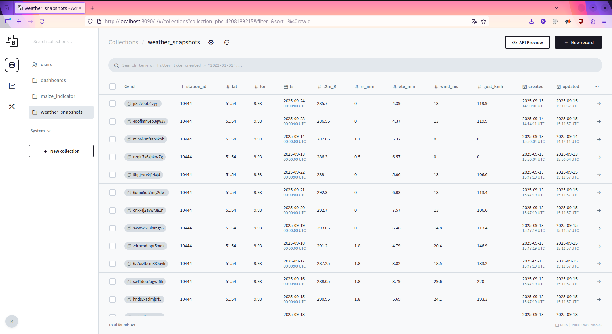
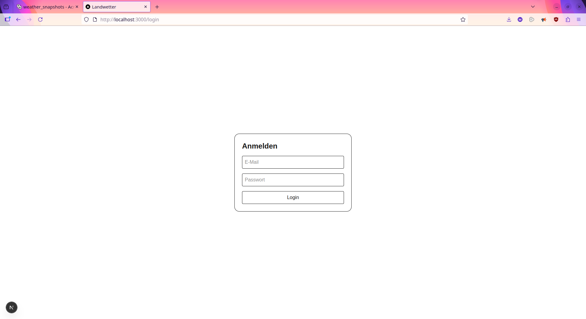

# Landwetter - Wetter-Dashboard für Landwirtschaft (Bericht)

## 1. Ziel & Motivation
Ziel ist eine Webandwendung, die aktuelle Wetter- und Agrarinformationen für landwirtschaftliche
Entscheidungen bündelt. Kern ist ein **Mais-Gesundheitsindikator**, der auf einer Wasserbilanz
(Regen - kulturabhängige Verdunstung) basiert und schnell zeigt,
ob Bewässerung erforderlich ist.

## 2. Architektur & Entscheidungen

- **Frontend**: Next.js (React + TypeScript). Gründe: 
	- moderne Developer Experience: Dateibasiertes Routing, gute Ordnerstruktur,
	CSS/Fonts-Handling usw. alles out of the box
	- Client-Side Rendering:
	  - Die Widgets können im Browser gerendert und können dort WebSocket/Realtime-Updates von PocketBase empfangen
	- großes Ökosystem:
	  - Riesige Community, viele React-Bib(z.b. react-grid-layout, i18n) gute Doku und Beispiele - man findet schnell Lösungen.
- **Backend/DB**: **PocketBase** statt eines eigenen Express/FastAPI-Backends. Gründe:
  - Bereitstellung von Auth, REST, Realtime, Admin-UI **out_off_the_box**
  - spart erhebliche Implementationszeit (der Tip/die Rückmeldung war wirklich gold wert, die bewusste Reduktion des Umfanges war dringend nötig um den Zeitrahmen nicht zu sprengen, hier hatte ich vorallem am Anfang Probleme) 
  -**Importer/Cron**: Python-Script ruft DWD-API ab schreibt Snapshots in PocketBase (alle 8h).
  -**Kommunikation**: Frontend liest über PocketBase-SDK
  
## 3. Datenmodell (Pocketbase)
**weather_snapshots**: `station_id`, `lat`, `lon`, `ts`, `t2m_K`, `rr_mm`, `eto_mm`, `wind_ms`, `gust_kmh`  
**maize_indicator**: `location_name`, `lat`, `lon`, `window_days`, `water_balance_mm`, `stress_level`, `plant_state`  
**dashboards**: `user` (-> users), `layout_json`, `widgets_json`

**API-Regeln**:  
- Lesen: `@request.auth.id != ""`  
- Schreiben: `dashboards` nur eigener User; `weather_snapshots`/`maize_indicator` nur Import-User/Server.

## 4. Fachlogik Mais-Indikator
Hilfreich war vorallem: https://www.fao.org/4/x0490e/x0490e00.htm#Contents
- **ET₀** nach Hargreaves-Samani (FAO-56). Gleichung aus Kapitel 3 als Alternative,
wenn Strahlung/Feuchte/Wind fehlen
- **Kc-Kurve Mais** (vereinfacht): 0.3 -> 1.2 -> 0.7 -> 0.5 je nach Tagen nach Aussaat.
- **ETc = Kc · ET₀**; **Wasserbilanz** = Summe (Regen − ETc) über Fenster `window_days`. Kc Konzept - Kapitel 5/6 ; Kapitel 6 - "ETc- Single crop coefficient(KC)", siehe für mais auch table 12
- **Einstufung**: `ok ≥ 0 mm`, `warnung ≥ −30 mm`, `kritisch < −30 mm` -> Darstellung als Pflanze (vital/gestresst/vertrocknet). siehe auch Kapitel 8

## 5. Implementierung Frontend
- **Widgets**: Aktuelles Wetter, 3-Tage-Prognose, Wind & Böen, Radar (RainViewer-Embed), Mais-Gesundheit.
- **Layout**: react-grid-layout mit Drag & Drop Speicherung pro Benutzer in `dashboards.layout_json`, Reset-Button.
- **Live-Updates**: PocketBase Realtime via `subscribe("*", ...)`.
- **Internationalisierung**: einfacher i18n-Context, Umschalter DE/EN; alle Labels als Schlüssel.
- **Theming**: Umschalter Light/Dark/System.

## 6. Betrieb
- **PocketBase**: lokal gestartet, Admin-UI zur Pflege von Nutzern/Collections.
- **Importer**: `dwd_sync.py` (Python, `requests`), per Cron `0 */8 * * *`.
- **Konfiguration**: `.env.local` (Frontend), Umgebungsvariablen für Script (`PB_URL`, `PB_USER_EMAIL`, `DWD_STATION`, …).

## 7. Ergebnisse / Screenshots

## 8. Bewetung & Ausblick
- **Ziele erreicht**: Alle Kern-Widgets, Live-Daten, Layout-Persistenz, Dark-Mode,
Mais-Indikator funktional.
- **Trade-off**: 
  - PocketBase anstelle eines "klassischen" Backend - großes Zeitersparnis
  - Usererstellung erfolgt Manuell durch einen Admin
  - Unten aufgelistetes weiteres Potential wurde rausgelassen - out of scope
- **Weiteres Potential**:
  - zusätzliche Kulturen (weitere Kc-Kurven),
  - konfigurerbare Stationen,
  - Benachrichtigung bei "kritisch",
  - NDVI-Widget (Satellitendaten).
  
## Rechtliches
- DWDAPI via bundesAPI (öffentlicher Zugang, bitte Nutzungsbedingungen beachten
- Radar eingebettet über RainViewer (Branding/Link bleibt sichtbar, für Edu-Purposes nutzen)

## Im Anschluss
- Das ganze wurde nun auf den Server der GWDG deployed, bzw. auf deren Linux-VM
  Hierbei wurde nichts wesentliches verändert und nur ein paar bugs gefixed die mir aufgefallen sind.
