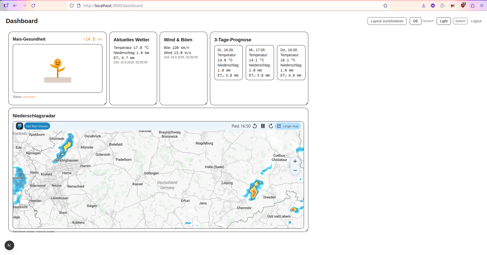

# Landwetter - Wetter-Dashboard für Landwirtschaft

Web-App für Landwirt:Innen: aktuelle Wetterdaten, 3-Tage-Prognose, Niederschlagsradar,
Wind & Böen, **Mais-Gesundheitsindikator**

## Features

- **Dashboard mit Widgets**: Aktuelles Wetter, 3-Tage-Proggnose, Wind & Böen, Niederschlagsradar, Mais-Gesundheit
- **Drag & Drop**: (react-grid-layout) + **Layout-Speicherung** pro User
- **Live-Updates** via PocketBase Realtime
- **Dark/Light/System - Theme** + Lokalisierung **Deutsch/Englisch** umschaltbar
- **Mais-Indikator**: Wasserbilanz über Fenster 'window_days' (ET nach Hargreaves, Kc-Kurve für Mais)



## Läuft nun auf den GWDG Servern
Pocketbase Login: https://141.5.106.126.sslip.io/pb/_/#/login

Website: https://141.5.106.126.sslip.io/login

PB-API Healthcheck: https://141.5.106.126.sslip.io/pb/api/health

To check if active:
PocketBase:
```bash
systemctl is-enabled pocketbase
systemctl is-active pocketbase
```
Cron:
```bash
systemctl is-active cron
```
landwetter-dev:
```bash
systemctl status landwetter-dev --no-pager
```


## Stack

- **Frontend**: Next.js(React+TypeScript)
- **Backend/DB**: PocketBase (Auth, REST, Realtime, SQLite)
- **Importer/Cron**: Python-Skript 'scripts/dwd_sync.py' (holt DWD-Daten)

## Repository-Struktur

```
landwetter/
|-- app/# Next.js App
| |--src/
| | |--app/..(pages)
| | | |--legal/..(Impressum, Datenschutz, Barrierefreiheit)
| | |--components/..(Widgets,I18n,Theme)
| | |--lib/..(pb client, dashboardStore)
| |--.env.local # NEXT_PUBLIC_PB_URL=..
|-- pb/ # Pocketbase Daten(pb_data/)
|-- scripts/  Python Importer (DWD)
| |--dwd_sync.py
| |--run_dwd_sync.sh
| |--.venv/(virtualenv)
|--README.md
|--Bericht.md
```

## Legal
Für Impressum, Datenschutz, Barrierefreiheit Hinweise bitte F11 drücken.

## Vorraussetzungen

- Node 18+/20+
- Python 3.10+
- PocketBase Binary (oder Docker)
- Internetzugang für DWD-API


## Pocketbase starten

```bash
# Beispiel: lokaler Start (Binary)
./pocketbase serve --http 127.0.0.1:8090 --dir pb_data
# Admin UI: http://localhost:8090/_/
```


## Nutzer anlegen

- In der Admin-UI -> **users** -> neuen Benutzer (E-Mail/Passwort) erstellen.
- (Für MVP ohne E-Mail-Verifikation.)

## Collections (Kurzüberblick)

**maize_indicator** (Base)
- location_name(text, required=
- lat (number), lon(number
- window_days(number)
- water_balance__mm(number
- stress_level (select: ok|warnung|kritisch)
- plant_state(select: vital|gestresst|vertrocknet)

**weather_snapshots** (Base)
- station_id(text)
- lat (number), lon(number)
- ts (date, required)
- t2m_K(number), rr_mm(number), eto_mm(number)
- wind_ms(number), gust_kmh(number)

**dashboards** (Base)
- user (relation -> users, required, unique per user)
- layout_json (json), widgets_json(json, optional)

**API Rules**
- List/Viwe: @request.auth.id != ""
- Create/Update/delete:
  - dashboards: user.id = @request.auth.id
  - maize_indicator/wheather_snapshots: nur Import-User/Script
  
## 2.) Frontend starten

```bash

cd app
npm i
printf "NEXT_PUBLIC_PB_URL=http://localhost:8090\n" > .env.local
npm run dev
# http://localhost:3000
```

Login unter/login   .

## 3.) DWD-Importer (Python)

```bash
cd scripts
python3 -m venv .venv && source .venv/bin/activvate
pip install requests
```

Umgebung setzen:

```bash

export PB_URL=http://localhost:8090
export PB_USER_EMAIL='testUser@example.com'
export PB_USER_PASSWORD='testPassword'

export DWD_API=https://dwd.api.proxy.bund.dev
export DWD_STATION=10444
export SOWING_DATE=2025-05-01
export WINDOW_DAYS=7

export LAT=51.54
export LON=9.93
export LOCATION='Göttingen'
```

Dann:
```bash
python3 dwd_sync.py
```

## Cron einrichten(alle 8h)

```bash
crontab -e
# Beispielzeile:
0 */8 * * * /PFAD/landwetter/scripts/run_dwd_sync.sh >> /PFAD/landwetter/scripts/dwd.log 2>&1
```
# Wie der Mais-Indikator berechnet wird

Anmerkung: Es gibt keine Gewährleistung für die Richtigkeit der Aussagen, die der Mais-Indikator trifft.
Ich bin ein Laie auf dem Gebiet und habe mich versucht bestmöglich einzulesen.
Formeln hier entnommen: https://www.fao.org/4/x0490e/x0490e00.htm#Contents

- **ET₀ (Hargreaves–Samani, FAO-56)**  
  $ET_0 = 0{,}0023 \cdot (T_{\text{mean}} + 17{,}8) \cdot \sqrt{\,T_{\text{max}} - T_{\text{min}}\,} \cdot R_a$

- **Kulturkoeffizient $K_c$ (Mais, grob):**  
  0–30 Tage: 0,3 -> 30–60 Tage: *linear bis* 1,2 -> 60–110: 1,2 -> 110–140: 0,7 -> danach 0,5

- **$ET_c = K_c \cdot ET_0$**

- **Wasserbilanz (Fenster `window_days`):**  
  $\sum (Regen_{\text{Tag}} - ETc_{\text{Tag}})$

- **Schwellen:**  
  ok (≥ 0 mm), warnung (≥ −30 mm), kritisch (< −30 mm)

-> Visualisierung als Pflanze (vital/gesund -> gestresst/vertrocknet).

## Troubleshooting
- PB gesund?
```bash
curl http://localhost:8090/api/health
```

## Danksagungen/Lizenzen

- DWD API: dwd.api.proxy.bund.dev
- Radar: RainViewer (eingebetteter Player, Link/Button "Get RainViewer" bleibt sichtbar).
Bitte Nutzungsbedinungen beachten, für educational purpuses frei nutzbar


